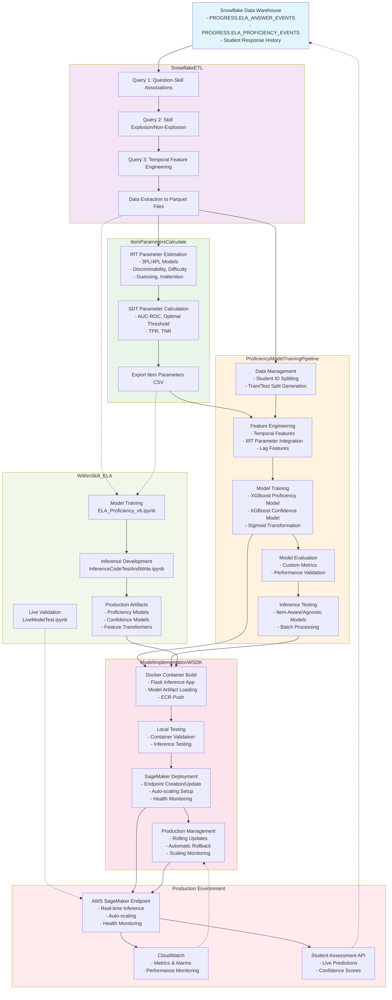

# Educational Assessment ML System - Architecture Diagram

## Component Descriptions

### 1. **SnowflakeETL** (Data Foundation)
- **Purpose**: Extract and transform raw educational response data
- **Key Features**: Three-stage ETL process, skill explosion, temporal windowing
- **Output**: Clean parquet files for training and analysis

### 2. **ItemParametersCalculate** (Educational Analytics)  
- **Purpose**: Calculate item difficulty and discrimination using IRT/SDT
- **Key Features**: 3PL/4PL models, signal detection theory, parallel processing
- **Output**: Item parameter CSV with educational psychometric properties

### 3. **ProficiencyModelTrainingPipeline** (ML Engine)
- **Purpose**: Train sophisticated ML models for student proficiency prediction
- **Key Features**: XGBoost models, confidence estimation, feature engineering
- **Output**: Trained models and evaluation metrics

### 4. **ModelImplementationWSDK** (Production Deployment)
- **Purpose**: Deploy and manage ML models in production AWS infrastructure
- **Key Features**: Docker containers, auto-scaling, rolling updates, health monitoring
- **Output**: Live SageMaker endpoints with enterprise-grade operations

### 5. **WithinSkill_ELA** (Reference Implementation)
- **Purpose**: Demonstrate complete system integration for English Language Arts
- **Key Features**: End-to-end pipeline, inference testing, production validation
- **Output**: Working production models and deployment artifacts

## Data Flow Summary

1. **Data Ingestion**: Student responses flow from educational applications to Snowflake
2. **ETL Processing**: SnowflakeETL transforms raw data into ML-ready datasets
3. **Item Analysis**: ItemParametersCalculate generates educational psychometric parameters
4. **Model Training**: ProficiencyModelTrainingPipeline creates prediction models
5. **Deployment**: ModelImplementationWSDK deploys models to production infrastructure
6. **Live Inference**: Production endpoints serve real-time student proficiency predictions
7. **Monitoring**: Continuous performance monitoring and automatic scaling based on demand
8. **Feedback**: Production predictions and performance data inform future model iterations 